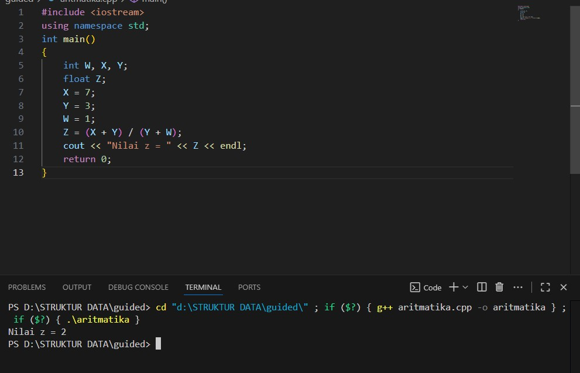
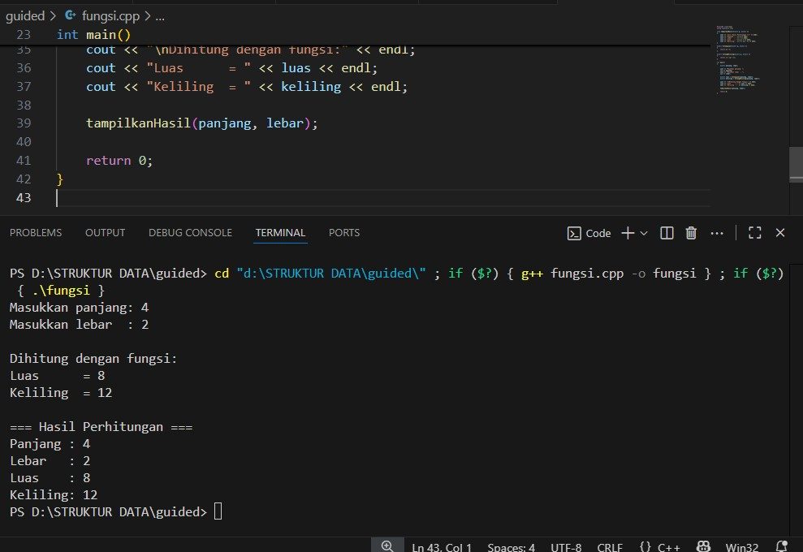
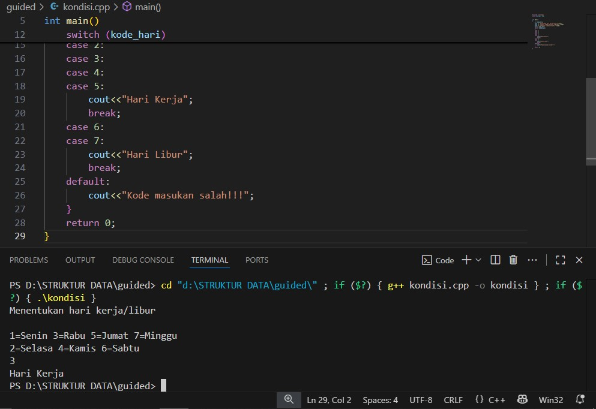
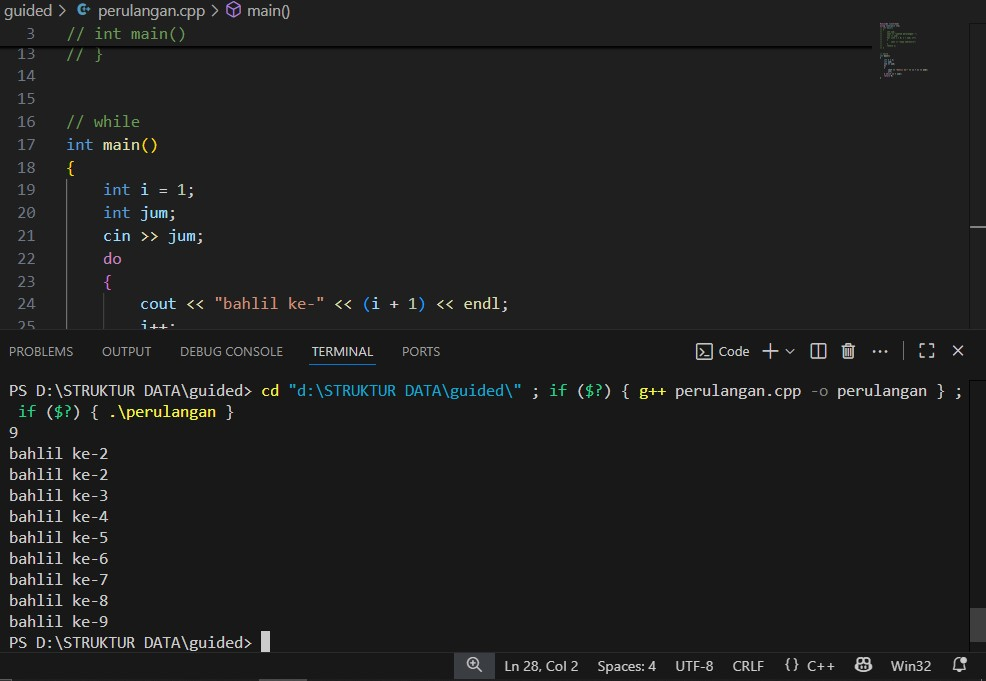
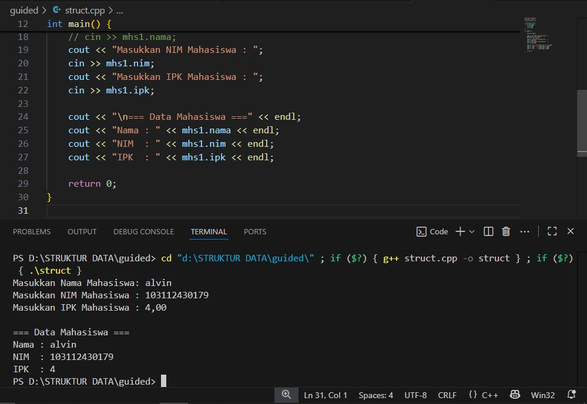
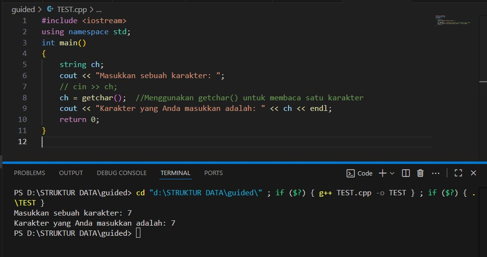
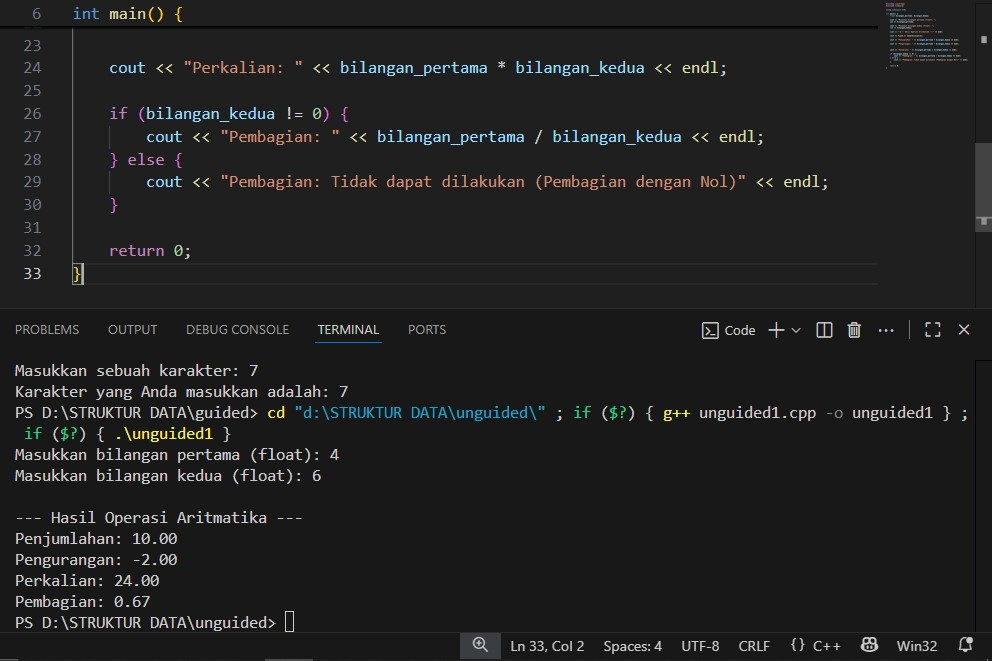
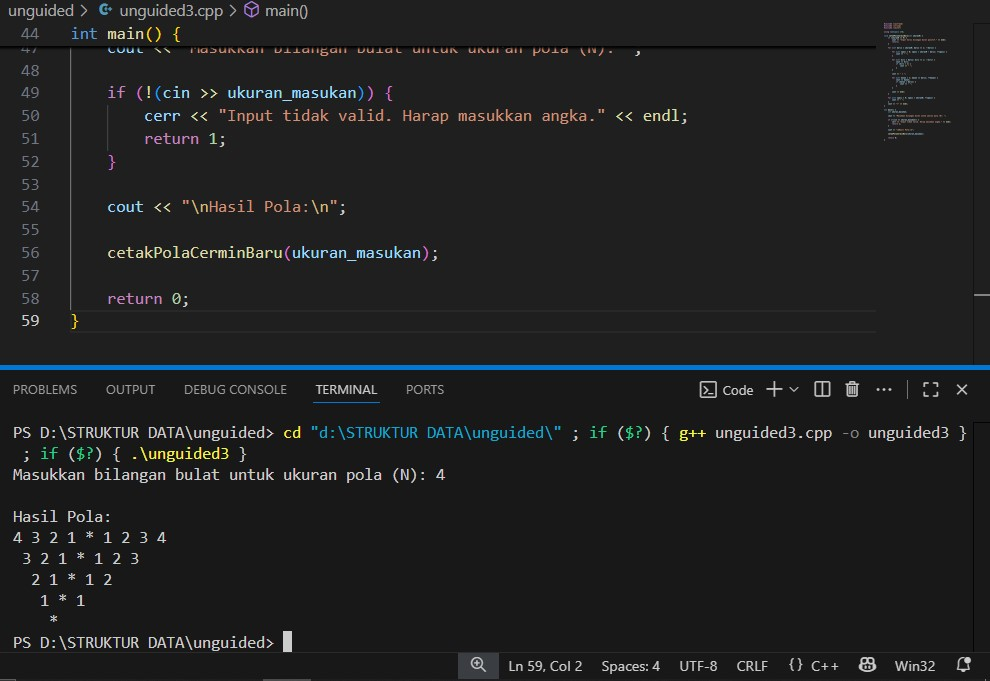

# <h1 align="center">Laporan Praktikum Modul 1 <br> PENGENALAN C++ </h1>
<p align="center">ALVINSA HAFIZH ARKAAN - 103112430179</p>

## Dasar Teori

C++ merupakan bahasa pemrograman yang dikembangkan oleh Bjarne Stroustrup pada awal tahun 1980-an pada Bell Laboratories. C++ merupakan pengembangan dari bahasa C menggunakan penambahan konsep pemrograman berorientasi objek (Object-Oriented Programming / OOP), sehingga dapat digunakan untuk membangun perangkat lunak dari skala kecil hingga besar dengan lebih efisien.C++ tetap menjadi salah satu bahasa pemrograman penting yang digunakan untuk pengembangan berbagai jenis perangkat lunak sampai saat ini.
## Guided

### soal 1 (Aritmatika)
    #include <iostream>
    using namespace std;
    int main()
    {
    int W, X, Y;
    float Z;
    X = 7;
    Y = 3;  
    W = 1;
    Z = (X + Y) / (Y + W);
    cout << "Nilai z = " << Z << endl;
    return 0;
    }

Kode C++ di atas adalah program sederhana yang menghitung nilai variabel Z. pertama deklarasi dan inisialisasi Tiga variabel, W, X, dan Y, dideklarasikan sebagai bilangan bulat (int). Satu variabel, Z, dideklarasikan sebagai bilangan pecahan (float), nilai awal diberikan kepada variabel int: X=7, Y=3, dan W=1. Program mencetak teks "Nilai z = " diikuti dengan nilai yang tersimpan dalam Z.

> Output
> 


### soal 2 (fungsi)


    #include <iostream>
    using namespace std;

    // Prosedur: hanya menampilkan hasil, tidak mengembalikan nilai
    void tampilkanHasil(double p, double l)
    {
    cout << "\n=== Hasil Perhitungan ===" << endl;
    cout << "Panjang : " << p << endl;
    cout << "Lebar   : " << l << endl;
    cout << "Luas    : " << p * l << endl;
    cout << "Keliling: " << 2 * (p + l) << endl;
    }

    // Fungsi: mengembalikan nilai luas
    double hitungLuas(double p, double l)
    {    
    return p * l;
    }

    // Fungsi: mengembalikan nilai keliling
    double hitungKeliling(double p, double l)
    {
    return 2 * (p + l);
    }

    int main()
    {
    double panjang, lebar;

    cout << "Masukkan panjang: ";
    cin >> panjang;
    cout << "Masukkan lebar  : ";
    cin >> lebar;

    // Panggil fungsi
    double luas = hitungLuas(panjang, lebar);
    double keliling = hitungKeliling(panjang, lebar);

    cout << "\nDihitung dengan fungsi:" << endl;
    cout << "Luas      = " << luas << endl;
    cout << "Keliling  = " << keliling << endl;

    // Panggil prosedur
    tampilkanHasil(panjang, lebar);

    return 0;
    }

Kode C++ diatas secara modular menghitung dan menampilkan luas serta keliling persegi panjang. pertama variabel panjang dan lebar  dideklarasikan, dan pengguna diminta untuk memasukkan nilainya. lalu perhitungan main memanggil hitungLuas dan hitungKeliling untuk mendapatkan hasil dan menyimpannya ke dalam variabel lokal (luas dan keliling). Hasil perhitungan yang telah disimpan (luas dan keliling) dicetak ke konsol sebagai output pertama, Fungsi tampilkanHasil dipanggil. Fungsi ini mengulang perhitungan di dalamnya dan mencetak semua detail (panjang, lebar, luas, dan keliling) dalam format tabel yang rapi.

> Output
> 


### soal 3 (Kondisi)

```c++
#include <iostream>
using namespace std;
// int main()
// {
//     double tot_pembelian, diskon;
//     cout << "total pembelian: Rp";
//     cin >> tot_pembelian;
//     diskon = 0;
//     if (tot_pembelian >= 100000)
//         diskon = 0.05 * tot_pembelian;
//     cout << "besar diskon = Rp" << diskon;
// }


// int main()
// {
//     double tot_pembelian, diskon;
//     cout << "total pembelian: Rp";
//     cin >> tot_pembelian;
//     diskon = 0;
//     if (tot_pembelian >= 100000)
//         diskon = 0.05 * tot_pembelian;
//     else
//         diskon = 0;
//     cout << "besar diskon = Rp" << diskon;
// }


int main()
{
    int kode_hari;
    cout << "Menentukan hari kerja/libur\n"<<endl;
    cout << "1=Senin 3=Rabu 5=Jumat 7=Minggu "<<endl;
    cout << "2=Selasa 4=Kamis 6=Sabtu "<<endl;
    cin >> kode_hari;
    switch (kode_hari)
    {
    case 1:
    case 2:
    case 3:
    case 4:
    case 5:
        cout<<"Hari Kerja";
        break;
    case 6:
    case 7:
        cout<<"Hari Libur";
        break;
    default:
        cout<<"Kode masukan salah!!!";
    }
    return 0;
}
```

Program C++ ini adalah program dasar yang berfungsi untuk menentukan status hari (Hari Kerja atau Hari Libur) berdasarkan kode angka (1 hingga 7) yang dimasukkan oleh pengguna. Program ini menggunakan struktur kontrol switch-case untuk mengevaluasi input dan memberikan respons yang sesuai. Pertama adalah memetakan input bilangan bulat (kode_hari) menjadi salah satu dari tiga kategori: Hari Kerja, Hari Libur, atau Kode Masukan Salah. Program menampilkan panduan kode hari kepada pengguna 1 (Senin) hingga 5 (Jumat) 6 (Sabtu) dan 7 (Minggu) Input pengguna disimpan dalam variabel int bernama kode_hari. Jika input pengguna adalah nilai lain selain 1 sampai 7 (misalnya 0 atau 8), program menjalankan blok default dan mencetak pesan kesalahan "Kode masukan salah!!!".

> Output
> 


### soal 4 (Perulangan)

```c++
#include <iostream>
using namespace std;
// int main()
// {
//     int jum;
//     cout << "jumlah perulangan: ";
//     cin >> jum;
//     for (int i = 0; i < jum; i++)
//     {
//         cout << "saya sahroni\n";
//     }
//     return 1;
// }


// while
int main()
{
    int i = 1;
    int jum;
    cin >> jum;
    do
    {
        cout << "bahlil ke-" << (i + 1) << endl;
        i++;
    } while (i < jum);
    return 0;
}
```
Program C++ ini adalah program sederhana yang dirancang untuk mencetak pesan secara berulang menggunakan struktur perulangan do-while, dengan jumlah perulangan ditentukan oleh input pengguna. Kode ini memiliki dua blok, tetapi hanya blok kedua (yang tidak dikomentari) yang akan dieksekusi, yang mendemonstrasikan perulangan. Dua variabel bilangan bulat (int) dideklarasikan Berfungsi sebagai counter atau penghitung perulangan, diinisialisasi dengan nilai 1, digunakan untuk menyimpan jumlah atau batas perulangan yang akan dimasukkan pengguna. Lalu program meminta pengguna memasukkan nilai, yang langsung disimpan ke dalam variabel. Program menggunakan do-while, yang menjamin blok kode di dalamnya dieksekusi minimal satu kali, bahkan jika kondisi while salah sejak awal.


> Output
> 


### soal 5 (Struct)
```c++
#include <iostream>
#include <string>
using namespace std;

// Definisi struct
struct Mahasiswa {
    string nama;
    string nim;
    float ipk;
};

int main() {

    Mahasiswa mhs1;

    cout << "Masukkan Nama Mahasiswa: ";
    getline(cin, mhs1.nama);
    // cin >> mhs1.nama;
    cout << "Masukkan NIM Mahasiswa : ";
    cin >> mhs1.nim;
    cout << "Masukkan IPK Mahasiswa : ";
    cin >> mhs1.ipk;

    cout << "\n=== Data Mahasiswa ===" << endl;
    cout << "Nama : " << mhs1.nama << endl;
    cout << "NIM  : " << mhs1.nim << endl;
    cout << "IPK  : " << mhs1.ipk << endl;

    return 0;
}
```

Program C++ ini adalah program dasar yang mendemonstrasikan cara menggunakan struktur data (struct) untuk mengorganisir informasi yang saling terkait, mengambil input data tersebut dari pengguna, dan menampilkannya kembali. Program memulai dengan mendefinisikan sebuah struktur kustom bernama Mahasiswa. Struktur ini berfungsi sebagai cetak biru untuk mengelompokkan tiga anggota data yang berbeda tetapi logis menjadi satu unit Untuk menyimpan nama lengkap, untuk menyimpan nama lengkap, ntuk menyimpan Indeks Prestasi Kumulatif (IPK).

> Output
> 

### soal 6 (Test)
```c++
#include <iostream>
using namespace std;
int main()
{
    string ch;
    cout << "Masukkan sebuah karakter: ";
    // cin >> ch;
    ch = getchar();  //Menggunakan getchar() untuk membaca satu karakter
    cout << "Karakter yang Anda masukkan adalah: " << ch << endl;
    return 0;
}
```
Program C++ ini adalah program yang sangat singkat dan dirancang untuk membaca dan menampilkan satu karakter tunggal dari input pengguna, secara spesifik menggunakan fungsi C-style getchar(). Deklarasi Variabel: Variabel ch dideklarasikan sebagai tipe string. Lalu Pengambilan Karakter getchar() adalah fungsi dari pustaka C yang mengambil kode ASCII dari karakter pertama yang ada di input buffer (stdin), nilai karakter tunggal yang dikembalikan oleh getchar() kemudian disimpan ke dalam variabel string ch, Jika pengguna mengetik lebih dari satu karakter (misalnya, "dunia"), hanya karakter pertama ('d') yang akan diambil dan disimpan lalu terakhir program kemudian mencetak teks "Karakter yang Anda masukkan adalah: " diikuti dengan nilai karakter yang berhasil disimpan dalam variabel ch.

> Output
> 

## Unguided

### Soal 1

```c++
#include <iostream>
#include <iomanip>

using namespace std;

int main() {
    float bilangan_pertama, bilangan_kedua;

    cout << "Masukkan bilangan pertama (float): ";
    cin >> bilangan_pertama;

    cout << "Masukkan bilangan kedua (float): ";
    cin >> bilangan_kedua;

    cout << "\n--- Hasil Operasi Aritmatika ---" << endl;

    cout << fixed << setprecision(2);

    cout << "Penjumlahan: " << bilangan_pertama + bilangan_kedua << endl;

    cout << "Pengurangan: " << bilangan_pertama - bilangan_kedua << endl;

    
    cout << "Perkalian: " << bilangan_pertama * bilangan_kedua << endl;

    if (bilangan_kedua != 0) {
        cout << "Pembagian: " << bilangan_pertama / bilangan_kedua << endl;
    } else {
        cout << "Pembagian: Tidak dapat dilakukan (Pembagian dengan Nol)" << endl;
    }

    return 0;
}
```
>

Tujuan program ini  ini mengambil dua input nilai desimal dari pengguna dan menerapkan operator aritmatika standar padanya. Tujuannya adalah untuk mendemonstrasikan input/output dasar, operasi matematika, pengaturan format output, dan penanganan kondisi khusus. Dua variabel bertipe float dan dideklarasikan untuk menyimpan nilai input yang dapat berupa angka desimal, Program meminta pengguna untuk memasukkan nilai untuk kedua variabel tersebut melalui cout dan cin. Sebelum menampilkan hasil perhitungan, program menggunakan fungsi dari header <iomanip> untuk memformat output Mengatur output angka agar ditampilkan dalam format titik tetap (bukan notasi ilmiah), Menetapkan bahwa semua angka pecahan yang dicetak setelahnya akan memiliki dua angka di belakang koma (presisi 2). kemudian Program menjalankan dan mencetak hasil operasi secara berurutan.

> Output
> 

### Soal 2

```c++
#include <iostream>
#include <string>
#include <vector>

using namespace std;

const vector<string> teks_satuan_belasan = {
    "nol", "satu", "dua", "tiga", "empat", "lima", "enam", "tujuh", "delapan", "sembilan",
    "sepuluh", "sebelas", "dua belas", "tiga belas", "empat belas", "lima belas", 
    "enam belas", "tujuh belas", "delapan belas", "sembilan belas"
};

const vector<string> teks_puluhan = {
    "", "", "dua puluh", "tiga puluh", "empat puluh", "lima puluh", 
    "enam puluh", "tujuh puluh", "delapan puluh", "sembilan puluh"
};

string konversiAngkaKeTeks(int bilangan) {
    if (bilangan < 0 || bilangan > 100) {
        return "Nilai di luar jangkauan (0-100).";
    }
    
    if (bilangan < 20) {
        return teks_satuan_belasan[bilangan];
    } 
    else if (bilangan < 100) {
        int nilai_puluhan = bilangan / 10;
        int nilai_satuan = bilangan % 10;
        
        string hasil_konversi = teks_puluhan[nilai_puluhan]; 

        if (nilai_satuan != 0) {
            hasil_konversi += " " + teks_satuan_belasan[nilai_satuan];
        }

        return hasil_konversi;
    } 
    else {
        return "seratus";
    }
}

int main() {
    int bilangan_masukan;

    cout << "Input bilangan (0 s.d 100): ";
    if (!(cin >> bilangan_masukan)) {
        cerr << "Input bukan merupakan angka yang valid." << endl;
        return 1;
    }

    string hasil_teks = konversiAngkaKeTeks(bilangan_masukan);

    cout << "\n" << bilangan_masukan << " : " << hasil_teks << endl;

    return 0;
}
```
Program C++ ini dirancang untuk mengkonversi bilangan bulat dari 0 hingga 100 menjadi representasi teks (terbilang) dalam Bahasa Indonesia. Program ini menggunakan fungsi khusus dan array konstan untuk melakukan konversi menyimpan terbilang untuk angka 0 hingga 19 (misalnya, "nol", "satu", ..., "sembilan belas"). Ini mencakup angka-angka yang memiliki penamaan unik, Menyimpan terbilang untuk kelipatan puluhan (misalnya, "dua puluh", "tiga puluh") yang indeksnya dimulai dari 0,1,2,... mewakili 0,10,20,.... lalu program meminta pengguna memasukkan sebuah bilangan dan menyimpannya di variabel, Menggunakan if (!(cin >> bilangan_masukan)) untuk memeriksa apakah input yang dimasukkan benar-benar bilangan bulat. Jika tidak valid (misalnya, memasukkan huruf), program mengeluarkan pesan kesalahan dan keluar. lalu Memanggil konversiAngkaKeTeks untuk mendapatkan representasi teks dari input. terakhir Mencetak angka yang dimasukkan dan hasil terbilangnya.

> Output
> 

### Soal 3

```c++
#include <iostream>
#include <string>
#include <vector> 

using namespace std;

void cetakPolaCerminBaru(int ukuranN) {
    if (ukuranN <= 0) {
        cout << "Input harus bilangan bulat positif." << endl;
        return;
    }

    for (int baris = ukuranN; baris >= 1; --baris) {
        
        for (int spasi = 0; spasi < ukuranN - baris; ++spasi) {
            cout << " ";
        }

        for (int kiri = baris; kiri >= 1; --kiri) {
            cout << kiri;
            if (kiri > 1) {
                cout << " "; 
            }
        }
        
        cout << " * "; 

        for (int kanan = 1; kanan <= baris; ++kanan) {
            cout << kanan;
            if (kanan < baris) {
                cout << " "; 
            }
        }

        cout << endl; 
    }
    
    for (int spasi = 0; spasi < ukuranN; ++spasi) {
        cout << " ";
    }
    cout << "*" << endl;
}

int main() {
    int ukuran_masukan;

    cout << "Masukkan bilangan bulat untuk ukuran pola (N): ";
    
    if (!(cin >> ukuran_masukan)) {
        cerr << "Input tidak valid. Harap masukkan angka." << endl;
        return 1;
    }

    cout << "\nHasil Pola:\n";

    cetakPolaCerminBaru(ukuran_masukan);

    return 0;
}
```

Tujuan utama program ini adalah menerima satu bilangan bulat positif (N) dari pengguna, lalu menggunakan nilai tersebut sebagai dimensi untuk menghasilkan pola visual unik di konsol yang terdiri dari angka dan karakter asterisk (*). Perulangan mencetak spasi di awal setiap baris. Ini menciptakan efek segitiga terbalik di mana baris atas memiliki spasi paling sedikit, dan indentasi meningkat seiring berkurangnya nilai baris. Perulangan mencetak angka dari nilai baris saat ini turun hingga 1 (…3 2 1). Spasi ditambahkan di antara angka kecuali setelah angka 1, Perulangan for (int kiri = baris; kiri >= 1; --kiri) mencetak angka dari nilai baris saat ini turun hingga 1 (…3 2 1). Spasi ditambahkan di antara angka kecuali setelah angka 1, Program mencetak pemisah " * " yang berfungsi sebagai sumbu simetri cermin di antara dua urutan angka, Perulangan for (int kanan = 1; kanan <= baris; ++kanan) mencetak angka dari 1 naik hingga nilai baris saat ini (1 2 3…).

> Output
> 

penjelasan bedanya sesuai soal

## Referensi

1. https://en.wikipedia.org/wiki/Data_structure (diakses blablabla)
